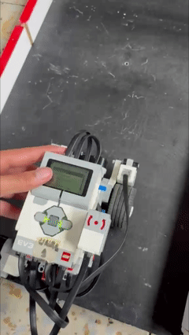

# 🚗 Navegación y resolución de laberintos con LEGO EV3

Para este proyecto se implementó el algoritmo BUG2 utilizando odometría visual. Para no ser tan técnico, básicamente en la primera parte de la trayectoria se usa un sensor de color que sigue la línea correspondiente a la ruta que debe seguir el robot. Para seguir esta línea se implementó un control proporcional.

Por otro lado, cuando el robot se encuentra con un obstáculo, este presenta tres fases diferentes. Una de ellas consiste en realizar *wall following*, que básicamente es seguir la pared. Después, cuando detecta que ya no hay pared, automáticamente empieza a buscarla nuevamente. Si la encuentra, continúa siguiéndola; de lo contrario, se espera que vuelva a seguir la línea inicial.

Además, se implementó un algoritmo de resolución de laberintos. En este caso, se utilizó el algoritmo Pledge para la resolución de cualquier laberinto bidimensional.

# ⚙️ Hardware

- LEGO EV3
- Sensor ultrasónico
- Sensor táctil
- Motores EV3

---

# 📌 Características

- Implementación del algoritmo BUG2
- Navegación reactiva en tiempo real
- Seguimiento de línea mediante sensor de color
- Control proporcional (P-Control)
- Evitación reactiva de obstáculos
- Wall following (seguimiento de paredes)
- Búsqueda y reacoplamiento a la trayectoria original
- Resolución de laberintos bidimensionales
- Implementación del algoritmo Pledge
- Programación en Python para LEGO EV3
- Uso de ev3dev y ev3dev2

---

# ⚙️ Hardware

- LEGO EV3
- Sensor ultrasónico
- Sensor táctil
- Motores EV3

---

# 📂 Estructura del proyecto

```bash
.
├── implementationBug2.py     # Implementación del algoritmo BUG2
├── mazesolution.py           # Resolución de laberintos con algoritmo Pledge
└── README.md
```

# 📸 Resultados

## 🚧 Implementación BUG2


📹 Video completo:  
[Descargar video BUG2](Videos/Bug2.mp4)

## 🧩 Resolución de laberintos



📹 Video completo:  
[Descargar video MazeSolving](Videos/mazes.mp4)

### ⚠️ Problemáticas presentadas
Las problemáticas presentadas en esta práctica estuvieron principalmente relacionadas con la resolución y la repetibilidad de los sensores. En algunos momentos, los sensores no contaban con la suficiente precisión para el tipo de control que se estaba implementando. Además, se evidenciaron diferencias en los ángulos de giro del robot; por ejemplo, en ciertas ocasiones el robot giraba 90°, mientras que en otras realizaba giros de 89° o valores cercanos. Esta falta de repetibilidad provocó que la práctica tuviera que ajustarse continuamente a medida que se identificaban nuevas problemáticas durante las pruebas.

Por otro lado, el lenguaje seleccionado para esta práctica también representó una limitación. Python, aunque es un lenguaje muy flexible y sencillo de implementar, resulta más lento en comparación con otros lenguajes de programación de bajo nivel. Esto afecta especialmente procesos que requieren una ejecución rápida y constante, como los lazos de control y algunos cálculos en tiempo real, generando pequeños retardos en la respuesta del sistema.


# 👨‍💻 Autor

Jeison Nicolas Diaz Arciniegas

---

# 📄 Licencia

MIT License